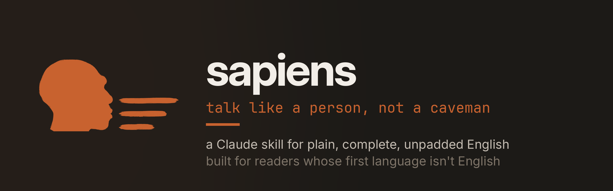

<div align="center">

<picture>
  <source media="(prefers-color-scheme: dark)" srcset="assets/logo-banner.png">
  <source media="(prefers-color-scheme: light)" srcset="assets/logo-banner-light.png">
  
</picture>

<br>

**A Claude skill for reading a codebase you did not write.**
It keeps the agent's answers short, plain and complete. You join a project in the middle and
understand it, without drowning in the reply.

<br>

[](https://agentskills.io/specification.md)
[](LICENSE)
[](https://github.com/parhamdavari/sapiens/stargazers)
[](https://github.com/parhamdavari/sapiens/actions)

[Install](#install) · [Before / after](#before-and-after) · [Where it helps](#where-this-helps-most) · [Levels](#three-levels) · [What I measured](#what-i-measured) · [Limits](#what-this-evidence-does-not-show) · [vs caveman](#how-this-differs-from-caveman)

</div>

---

Joining an existing project is mostly reading. You ask the agent what a pull request does,
why a module exists, what breaks if you touch it. The agent is your interface to a system
nobody is going to walk you through.

That is where the default answer costs you most. It narrates every step. It restates your
question. It answers a bigger question than you asked, so the part you needed is buried. It
uses the team's internal words without explaining them, which is the one thing a newcomer
cannot afford. On a task that fans out to sub-agents it reports each one as it lands, then
repeats all of it at the end.

The usual fix makes it worse. Token-compression tools drop articles, prepositions and
connecting words. That reads fine if English is your first language. If it is not, those
small words are what tell you which noun is the subject and how the clauses relate. Removing
them turns a terse reply into a puzzle.

Sapiens takes the middle path. It cuts the padding and keeps the grammar.

## What the skill actually changes

Eight real scenarios, each answered twice by the same model: once with the skill, once with none. The size numbers live in [What I measured](#what-i-measured) below. This run measured three things that table does not.

**Most style rules were already free.** The baseline never produced a banned opener or closer in 8 replies. It never used one of the 37 inflated-vocabulary words tested. It never restated the question, and it stayed inside IELTS Band 6 vocabulary. Those rules moved out of the skill body, because a rule the model already follows is not earning its tokens. Figurative language was the exception, with 2 baseline hits, and it is the one lexical rule that stayed.

**The gap is widest where benchmarks rarely look.** Task prompts got shorter, but open-ended questions got shorter by more. An opinion question gives the default style the most room to expand, so that is where the skill pays off most.

**Two known failures ship with this release.** The baseline sometimes volunteers advice attached to a later moment, such as making a migration re-runnable before production. The skill drops that advice, and evals 5 and 7 fail on purpose to keep the gap visible.

Method, full results, and the corrections behind them: [`docs/HONEST-NUMBERS.md`](docs/HONEST-NUMBERS.md).

## What it looks like

The same question: *"I have to review PR #142 tomorrow and I haven't followed it at all. What's it about?"*

**Without sapiens** (274 words, longest sentence 33 words, 8 em dashes):

> PR #142 adds a retry queue for webhook delivery — a fairly self-contained feature, about +412/-87 across 9 files. Here's the shape of it:
>
> **The core change:** `src/queue/RetryQueue.ts` is new (180 lines) and implements exponential backoff with jitter, capped at 5 attempts. `src/webhooks/dispatch.ts` is the integration point — previously a failed send was logged and dropped, now it enqueues instead.
>
> **Persistence:** `src/queue/store/RedisStore.ts` is also new, backing the queue with Redis so that pending retries survive a process restart…
>
> *(continues through config, tests, review status, and the open design question)*

**With sapiens** (163 words, longest sentence 23 words, no em dashes):

> It makes webhook delivery retry instead of giving up. Today a failed send is logged and dropped. With this change, failures go into a queue and get retried up to five times, with a growing delay between attempts. The queue is stored in Redis, so pending retries survive a restart. It also adds a database table for the queued jobs and 14 new tests. Roughly 400 lines added across 9 files, so it's a real review but not a huge one.
>
> Two things are unresolved, and those are what's worth your attention tomorrow. The platform team asked whether the Redis storage should share the existing cache cluster or get its own, and nobody has answered yet. The team also hasn't decided what should happen when a webhook still fails after the fifth attempt: page on-call, or fail silently. One teammate has already approved it.
>
> Tell me if you want the retry timing logic or the test coverage in more detail before the morning.

Note what did not happen. Nothing was fragmented, no articles were dropped, and the two decisions that actually need a human moved to the front instead of sitting at the end.

## Keep it on

A skill you have to ask for is a skill you will forget to ask for. One line in your global `CLAUDE.md`:

```markdown
Always use sapiens mode. Default level: lead.
```

Other setups: [`docs/ALWAYS-ON.md`](docs/ALWAYS-ON.md).

## Before and after

Same question. Same facts. Both answers were written from one fixture,
[`benchmarks/scenarios/pr-orientation.md`](benchmarks/scenarios/pr-orientation.md).

The question was: *what is this PR about?* The PR contained six separate fixes.

<table>
<tr><th width="50%">Without the skill</th><th width="50%">With the skill</th></tr>
<tr valign="top"><td>

> PR #662 (`fix: grounding enforcement + fail-closed corrections`) is a correctness/safety
> PR — it's open and still waiting on code review, not merged. It bundles six fixes, and the
> theme running through all of them is "stop reporting success when the system didn't
> actually do the work."
>
> **The main fix — grounding enforcement.** An agent member could assert a claim in its
> answer without ever having called a tool, and the orchestrator would still mark the run
> SUCCEEDED and bill the user for the tokens. …

`307 words` · `reading grade 9.3` · `average sentence 13.3 words`

[full text](benchmarks/results/pr-orientation--baseline.md)

</td><td>

> It's mainly a grounding fix for agent runs. Grounding here means every claim in a member's
> answer has to point at the tool call that produced it. Before this, a member could state a
> claim without calling any tool. The run was still marked SUCCEEDED, and the user was still
> charged for it. Now a member that can't show the tool call is marked as failed. …

`113 words` · `reading grade 6.0` · `average sentence 14.1 words`

[full text](benchmarks/results/pr-orientation--sapiens.md)

</td></tr>
</table>

Both blocks are the verbatim opening of the linked file, cut at a similar length and marked
with `…`. The counts and grades cover the full replies rather than the excerpts.

Notice the one number that goes the wrong way. The short answer has **longer** average
sentences than the baseline, 14.1 against 13.3. The baseline hits its low average partly
through bold labels and a numbered list, which are short lines rather than plain sentences.
Length fell by 63%. Sentence length did not.

The short version ends by **offering** the remaining detail in one line instead of
delivering it. The skill has a rule for that.

## Where this helps most

Brown-field work. Code that already exists, that you did not write, and that nobody has time
to explain to you.

Every scenario in the benchmark below is that job. What does this PR do? Do these four PRs
follow our rules? CI is red across three packages, what do I fix first? Those are the
questions of your first month on a codebase. They are also the ones where a padded answer
costs you the most time.

Four things in the skill target that job directly.

- **Undefined jargon gets defined once, in four or five plain words.** A codebase carries
  terms only its team knows. `grounding`, `fail-closed`, `credential broker`. A newcomer
  cannot look those up, because they mean something specific here and nothing anywhere else.
- **The answer is the size of the question.** "What is this PR about?" asks for orientation.
  It does not ask for a walk through all six fixes plus the review status.
- **The agent speaks once, not once per sub-agent.** Exploring a large repo fans out.
  Without a budget you read the same findings three times.
- **You pick the depth.** `lead` while you are orienting. `geek` when you are about to touch
  the code and need the exact function name.

It works on any long reply, not only on code. Brown-field reading is where the difference is
largest, because that is where you are least able to skim.

## Install

```bash
curl -fsSL https://raw.githubusercontent.com/parhamdavari/sapiens/main/install.sh | bash
```

<details>
<summary>Windows (PowerShell)</summary>

```powershell
irm https://raw.githubusercontent.com/parhamdavari/sapiens/main/install.ps1 | iex
```

</details>

<details>
<summary>Manual, or for a single project</summary>

Download `sapiens.skill` from
[the latest release](https://github.com/parhamdavari/sapiens/releases/latest). It is a zip
archive. Unpack it:

```bash
# for every project
unzip sapiens.skill -d ~/.claude/skills/

# for this project only, so your team gets it when you commit it
unzip sapiens.skill -d .claude/skills/
```

From a clone, run `bash install.sh --project`.

</details>

<details>
<summary>claude.ai and Cowork</summary>

Those load skills from your account rather than from your disk, and the two do not sync.
Upload `sapiens.skill` in **Settings → Capabilities → Skills**.

</details>

The installer copies files into your skills directory and does nothing else. It is 90 lines
and you should read it before you run it. Restart Claude Code, then type `/skills` to
confirm sapiens is listed.

## Using it

| You type | What happens |
|---|---|
| `sapiens mode` | On for the whole conversation |
| `/sapiens` | One reply only |
| `/sapiens geek` | One reply, at the geek level |
| `switch to lead` | Change level, stay on |
| `stop sapiens` | Off |

## Three levels

All three write full sentences in plain words. Only the technical depth changes.

| | Sounds like | Use when |
|---|---|---|
| **lead** *(default)* | A tech lead giving a status update | You want the outcome and whether it is handled |
| **dev** | A solid teammate explaining a change | Everyday use, when you will act on the answer yourself |
| **geek** | A technical peer who wants the details | You want exact files, functions and cause |

<details>
<summary>The same fix, described at each level</summary>

**lead**
> The login bug is fixed. It was a timing problem between two parts of the system, not bad
> user input like we first thought. Tests are passing now.

**dev**
> Found the bug in the login flow. The session token was being checked before it finished
> saving, so valid logins sometimes failed. I added a check that waits for the save to
> finish. It should be fixed now.

**geek**
> The bug was a race condition in `AuthProvider.login()`. The session token check ran before
> the `saveSession()` promise resolved, so a fast client sometimes failed a valid login. I
> added an `await` before the check and covered it with a new test in `auth.test.ts`.

</details>

## What I measured

Three scenarios, all of them brown-field reading tasks. Each one is a frozen set of facts.
Two agents answer the same question from those facts, one with the skill loaded and one
without. The facts do not change, so the only variable is how the answer gets written.

Raw transcripts and the full method are in [`benchmarks/`](benchmarks/). Recount them with
`npm run measure`.

The reading grade is the median of three formulas (Flesch-Kincaid, Coleman-Liau, ARI), so
no single heuristic decides the number. Words off-list is the share of words outside the
[NGSL](http://www.newgeneralservicelist.com), a published list of the core vocabulary a
competent learner knows. That column tests the plain-vocabulary claim directly.

| Scenario | | Times spoken | Words | Reading grade | Sentences >25w | Words off-list |
|---|---|---:|---:|---:|---:|---:|
| **4-PR review** | without | 3 | 500 | 8.2 | 6 | 17.0% |
| | with | **1** | **207** | **6.3** | **1** | 17.2% |
| **CI triage, 3 packages** | without | 5 | 313 | 5.5 | 2 | 13.7% |
| | with | **1** | **112** | **4.7** | **0** | **20.2%** |
| **"what is this PR about?"** | without | n/a | 307 | 9.3 | 1 | 11.4% |
| | with | n/a | **113** | **6.0** | **0** | **3.5%** |

Words spoken fell by 59%, 64% and 63%. In the two multi-step scenarios the assistant spoke
once instead of three and five times. The third scenario is a single question with no
sub-agents, so a turn count means nothing there.

The off-list column goes the wrong way in two rows, and one is large. The CI-triage short
answer is **worse** than its baseline, 20.2% against 13.7%. The reason is arithmetic: a
112-word reply keeps every package and command name but has a third of the denominator.
The orientation scenario shows the opposite, 3.5% against 11.4%, because there the skill
defines or drops jargon instead of listing it. Both facts are in the table because the
metric found them. A shorter denominator punishes short replies, and anyone quoting the
column should know that limit.

One caution about the turns column. A turn is counted from where the transcript records a
message rather than a silence, and I wrote the transcripts. It reports a judgement about
what the skill should suppress, not an observation of a live session.

### The idiom problem, which I have not managed to measure

Reading-grade formulas measure word length and sentence length. They cannot see idioms.
Take this sentence, from a real reply:

> that's a product call about how hard an uncited claim should bite

Every word is short and the sentence is short, so it scores as easy English. A reader who
knows every one of those words still cannot say what the sentence means. That gap is the
reason this skill exists, and it is the reason to distrust a readability score on its own.

The measurement is a different story. It has taken three attempts, and the third finally
removed me from it.

The first two idiom lists were written in this repo, and both turned out to contain
entries lifted from the very transcripts they scored. The current list is derived
mechanically from Wiktionary's English-idioms category by
[`scripts/build-idiom-list.mjs`](scripts/build-idiom-list.mjs). It keeps 6,698 of 10,585
raw entries. Every filter is stated in the script with its reason, and anyone can
reproduce the file byte for byte. Nobody who wrote that list ever saw this repo. Matching
is by exact word sequence, so a literal phrase can no longer trip a substring. A corpus
of literal phrases is asserted to zero hits in CI.

The result on the benchmarks: the sapiens transcripts score zero, and the baselines score
one hit each in two scenarios. The real-world reply, the one that motivated all of this,
**also scores zero.** Its sentences fail readers on phrases like *how hard an uncited
claim should bite*, which is a novel metaphor, not a catalogued idiom. No list catches a
metaphor someone just made up.

So the honest position stands: **the idiom effect is argued, not measured.** What changed
is the instrument. It is now independent and precise, and its blind spot is named. It
finds catalogued idioms, and the phrases that hurt most are the ones nobody catalogued.

## What this evidence does not show

Read this before you trust the table above.

- **One run per cell.** Three scenarios, one answer each way. That makes this a demonstration
  and not a study. The direction of each result is worth more than its decimal places.
- **I wrote both sides.** Agents produced the transcripts from the fixtures, and I selected
  and edited what went into `benchmarks/results/`. Nobody independent reviewed them. The
  "without" column is my reconstruction of default behaviour, not a recording of a live
  unassisted session.
- **No human was tested.** The whole argument is about comprehension for second-language
  readers, and there is no reader study behind it. Nobody was asked to read anything and
  then answer questions. If you want to run one, I would like to hear from you.
- **The reading-grade anchor is not cited.** Grade 8 or so is where I find English
  comfortable to read at speed as a non-native reader. That is my own calibration. I have no
  source tying an IELTS band to a Flesch-Kincaid grade.
- **The skill missed a finding once.** In `pr-review--sapiens.md` the short answer leaves out
  one detail the fixture contained: PR #669 showed its hook passing rather than deliberately
  failing. That is a weak-evidence finding, which is the exact category the skill's last
  self-check exists to protect. It is recorded in
  [`benchmarks/README.md`](benchmarks/README.md) rather than quietly fixed.
- **Correctness is not measured.** Word counts and reading grades say nothing about whether
  an answer is right.
- **The skill misses its own 25-word ceiling, and three attempts to fix it failed.** See
  the section below.

## The 25-word rule does not hold

Core rule 3 sets a 25-word ceiling on sentences. Pre-send check 3 says to count. Replies
generated with the skill loaded break that ceiling about as often as replies generated
without it.

Measured over 36 runs per arm on `claude-opus-5[1m]`, the current skill text averages 1.47
sentences over the ceiling per reply. The breaches are not marginal. Most are longer than
29 words, and the worst seen was 57.

The failure has a shape. It appears when a reply names three or more parallel items and
packs them into one comma chain. The `ci-triage` scenario, whose answer names a single
decision, almost never breaches. The two scenarios that list findings breach in nearly
every run.

Three edits have tried to fix it, and each is recorded in
[`benchmarks/runs/`](benchmarks/runs/) with its numbers:

| Attempt | What changed | Result |
|---|---|---|
| Wording of the pre-send check | strengthened the instruction to count | no effect |
| A target below the ceiling | aim for 15 to 20 words | p = 0.784 |
| An enumeration rule | parallel items never share a sentence | p = 0.475 at n=36 |

The third one is worth reading if you build with skills. At 18 runs per arm it showed the
target metric falling 38%, with every scenario improving and p = 0.158. Doubling the
sample collapsed the effect to nothing. Deciding after the first block would have put a
false claim on this page.

**The honest conclusion: this behaviour does not appear to be reachable by adding or
rewording a rule.** The instruction already appears twice. A third statement changed
nothing.

The rule stays in the skill. The writing it asks for is right even when compliance is
imperfect. Replies that break it are still far shorter and plainer than the baseline.
What changes is the claim. This page does not say the skill holds a 25-word
ceiling, because it does not.

Open as [issue #6](https://github.com/parhamdavari/sapiens/issues/6). The useful next step
is probably not a fourth rule. A severity-weighted metric would say whether the worst
sentences are shrinking even when the count does not move. A reader study would say
whether these sentences cost a reader anything at all.

## Does this repo follow its own rules?

Some of them, and CI checks it on every push.

```bash
npm run self-check
```

That sweeps the markdown files this project wrote and applies four of the skill's rules.
No sentence over 25 words. No idiom from the derived list. A median reading grade under
nine. At most three em dashes per file. A failure blocks the merge.

The transcripts and scenarios under `benchmarks/` are excluded. They are evidence and the
inputs to it, so editing either one to pass a style check would be worse than failing.
`benchmarks/README.md` is prose this project wrote, so it is checked.

Two things it does not do. It cannot check whether the writing is clear, only whether it
breaks countable rules. And quoted material is exempt, both blockquotes and inline quoted
strings, so a doc that mentions a banned phrase does not fail for mentioning it. The same
exemption would cover a bad sentence I chose to wrap in quotes, which is a hole I have
named rather than closed.

The version of this README before the pre-launch audit failed two of the four rules. It had
four sentences over the ceiling and fifteen em dashes against a budget of three. Its reading
grade and its idiom count were already fine. The old file is in this repo's git history:

```bash
git show 3b1d3f0:README.md > /tmp/old.md
npm run measure -- --prose-only /tmp/old.md
```

## How it works

The skill governs three things, ordered by how much waste each one causes.

**1. Size.** How much to say follows from the question, not from how much the model knows.
"What is this PR about?" asks for orientation. It does not ask for a walk through all six
fixes plus the review status plus the open design decision. When there is more worth saying,
the skill offers it in one line instead of delivering it.

**2. Frequency.** The default budget is two messages per task. One at the start if it needs
something from you, one at the end with the answer. Anything in between has to pass a single
test: does this change what you would do in the next minute? A blocker passes. A wrong
premise passes. Anything destructive passes and gets full detail. "Agent 3 of 4 finished"
does not, because the panel on your screen already says so.

**3. Sentence style.** Full grammar, common vocabulary, one idea per sentence with a 25-word
ceiling, no idioms, no undefined jargon, and none of the standard AI filler phrases.

A short checklist then runs on the finished draft. Rules alone drift, because a long reply
gets written one sentence at a time and no single sentence looks wasteful. The checks catch
what the rules miss. Is the answer the size of the question? Is anything here already known
to the reader? Count the words in the longest sentence. Scan once for figurative language.
The last check is the counterweight: did anything get dropped rather than shortened?

## How this differs from caveman

[caveman](https://github.com/JuliusBrussee/caveman) is good, and this project owes it the
idea. The two solve different problems. If you read English natively and you want the
smallest possible token bill, caveman is the better tool.

| | caveman | sapiens |
|---|---|---|
| Optimises for | Fewest output tokens | First-pass comprehension |
| Grammar | Articles and prepositions dropped | Never dropped |
| Best reader | Native or near-native | Anyone working in a second language |
| Idioms | Not addressed | Replaced with plain wording |
| Controls | How much is written | How much, how often, and how readable |

Dropping function words is close to free for a native reader, who fills the gaps from
context. It is expensive for everyone else, who has to rebuild the sentence.

One industry made the same trade-off deliberately.
[ASD-STE100 Simplified Technical English](https://www.asd-ste100.org/about_STE.html) is a
controlled language for aircraft maintenance documentation, published by the AeroSpace and
Defence Industries Association of Europe. It exists so that technicians reading in a second
language cannot misread an instruction. It restricts vocabulary and sentence length, and it
forbids dropping words for brevity.

STE is a drafting standard, not a controlled study of second-language comprehension. It
shows a choice being made under real consequences. It does not prove the choice is right.

## Contributing

The most useful thing you can send is a phrase that stopped you. Native speakers rarely find
these, because they read past them without noticing. If a reply made you re-read a sentence,
open a
[hard-phrase issue](https://github.com/parhamdavari/sapiens/issues/new?template=hard-phrase.md)
with the phrase and what you thought it meant.

See [CONTRIBUTING.md](CONTRIBUTING.md). One rule matters above the rest: **every number in
this repo comes from a run you can reproduce.** If you change a figure, include the command
that produced it.

## Privacy

The skill is Markdown. It runs no code, makes no network calls and collects nothing. The
installer downloads the repo archive if you are not running from a clone, copies the skill
into your skills directory, and stops.

## Credits

The idiom and filler catalogue draws on
[avoid-ai-writing](https://github.com/conorbronsdon/avoid-ai-writing) by Conor Bronsdon,
narrowed to the patterns that show up in conversational replies. The plain-language
principle comes from ASD-STE100. The naming and the packaging conventions follow the path
cut by [caveman](https://github.com/JuliusBrussee/caveman).

<div align="center">
<br>
<sub>MIT licensed. If it made a reply easier to read, a star helps other people find it.</sub>
</div>
